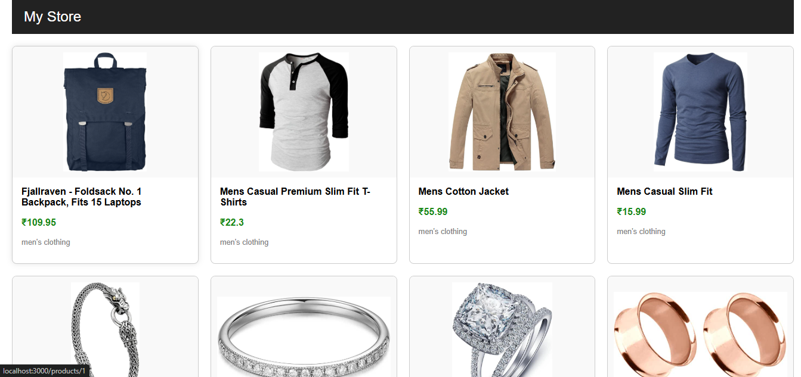
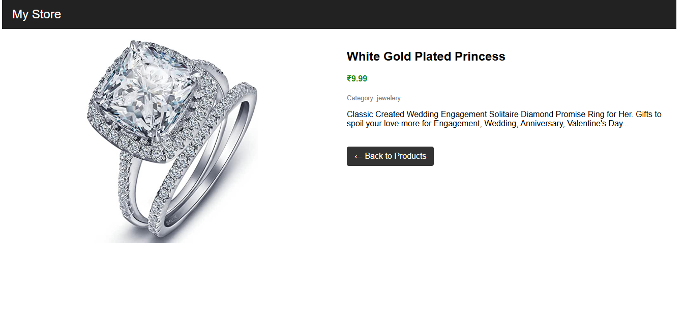

# 🛒 React Product Catalog App

A responsive product catalog built with React and custom CSS, displaying product data fetched from the [Fake Store API](https://fakestoreapi.com/). The app allows users to browse products, view detailed information, and navigate easily between product listings and individual product pages.

---

## 🚀 Features

- 📦 Fetches real-time product data from a public API
- 🖼️ Displays product image, title, category, and price in ₹
- 📄 Detailed view for each product with description and image
- 🔁 Seamless routing using React Router
- 📱 Fully responsive layout with pure CSS (no Bootstrap)

---

## 🛠️ Technologies Used

- **React.js**
- **React Router DOM**
- **JavaScript (ES6)**
- **Custom CSS (no framework)**
- **Fake Store API**

---

## 

**Product Listing Page**  

**Product Detail Page**  

---

## 🧑‍💻 Getting Started

### Prerequisites

- Node.js and npm installed

